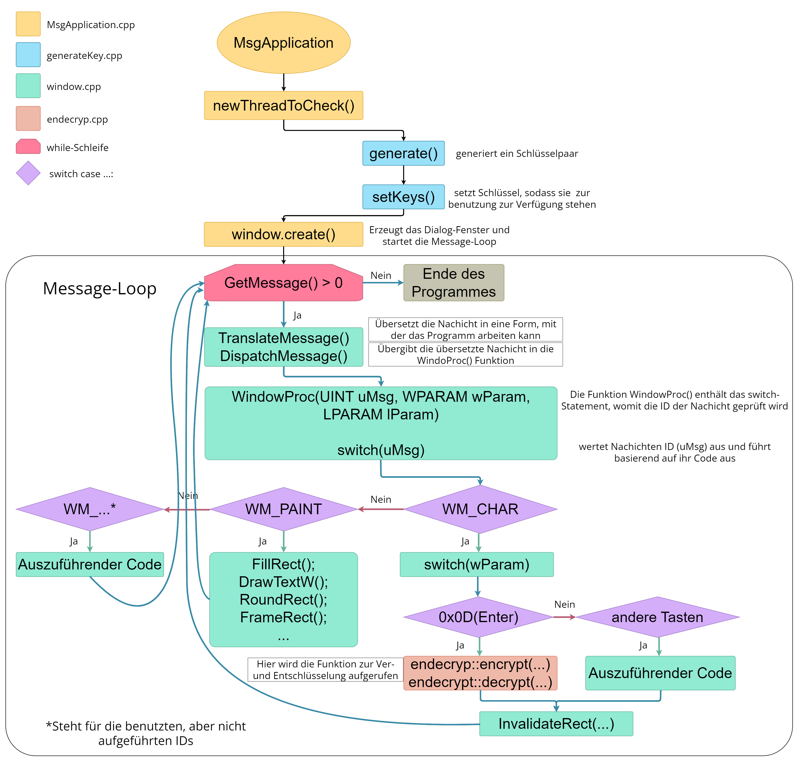

# Dokumentation MsgApplication

## Idee des Programmes
Die Idee des Programmes ist, das der Benutzter einen Text eingeben kann, welcher mit der RSA-Verschlüsselung verschlüsselt wird. Um diese Idee umzusetzen, verwende ich C++. Sollte Der Nutzer Enter drücken, wird der eigegebene Text mit den Generierten Schlüsseln Ver- und dann sofort wieder Entschlüsselt. Das Programm soll die Wirkungs und Arbeitsweise des RSA-Algorythmuses demonstrieren.
Zwar ist der RSA-Algorythmus nicht zum Ver- und Entschlüsseln von z.B. Texten gemacht, sonder dient der sicheren übertragung von Daten von einem Gerät zu einem anderen und wird deshalb oft zum Austausch von Schlüsseln von Symmetrischen Verschlüsselungsverfahren genutzt, da diese deutlich schneller und effizienter Arbeiten.

## Ablauf des Programmes

## Benutzte Klassen
### Auflistung aller selbstgeschriebenen und benutzten Klassen in dem Programm

- [MsgApplication.cpp](#MsgApplicationcpp)
- [generateKey.cpp](#generateKeycpp)
- [calcW.cpp](#calcWcpp)
- [endecrypt.cpp](#endecryptcpp)
- [window.cpp](#windowcpp)

## Importierte Funktionen/Libaries und DatenTypen

- windows.h -> benutzt für das Fenster und Windows eigene Datentypen (UINT, TCHAR, ...)
- thread -> benutzt für die Gleichzeitige Erstellung von dem Fenster und dem Schüssel
- iostream -> "Standart" Bibilotek, vereinfacht die Ausgabe von Text, Variablen, usw...; Viele andere Bibiloteken bauen auf ihr auf
- vector -> auch Liste genannt, dynamisches Array, was die Handhabung von Arrays einfacher macht (keine statische Größe, mehr möglichkeiten mit den daten zu interagieren(.push_back(); .size(); .clear(); ...), ...)
- chrono -> benutzt um die Ausführungszeit eines Programmabschnittes zu bekommen
- math.h -> nur für pow(x,y) benutzt
- WindowsX.h -> Benutzt um die X und Y Koordinaten aus der System-Nachicht zu bekommen, welche bei einem Mausklick abgeschickt wird (GET_X_LPARAM(lparam), GET_Y_LPARAM(lparam))

## Erklärung der einzelnen Klassen (chronoligisch)

### MsgApplication.cpp
Main Klasse. Das Programm startet hier und ruft die anderen Klassen auf.   

`thread t3(&generateKey::newThreadToCheck,&keyget);`

Erstellt einen neuen Thread, welcher parallel zum Main Thread das Schlüsselpaar generiert.

`window.create();`

Ruft die Funktion von window.cpp “void create()” auf. Diese sorgt für die Erstellung des Fensters.
Genauere Erklärung in [window.cpp](#windowcpp)

### generateKey.cpp
Klasse, die ausschließlich am Anfang des Programms aufgerufen wird, um die Schlüssel zu erstellen.

`void generateKey::newThreadToCheck()`

Diese Funktion wird vom neu erstellten Thread aus MsgApplication aufgerufen. Sie prüft, ob schon ein Schlüssel vorliegt. Sollte dies nicht der Fall sein, wird ein neues Schlüsselpaar erstellt (bisher wird der generierte Schlüssel noch nicht gespeichert).
Sollte kein Schlüssel vorliegen, wird die Funktion `generate()` aufgerufen.
Anschließend werden die generierten Schlüssel in der Funktion der Klasse `endecrypt()` hineingegeben, welche diese dort Speichert und die Schlüssel nun benutzt werden können.

`void generateKey::generate()`

Sollte kein Schlüssel gefunden worden sein, wid die Funktion von `newThreadToCheck()` aufgerufen. Sie generiert ein Schlüsselpaar, welches im weitern Verlauf des Programmes zum Ver- und Entschlüsseln genutzt wird.

~~~cpp
//set p and q to randomly chosen primes from the list
	q = primes[(rand() % (primes.size() - 1))];

	p = primes[(rand() % (primes.size() - 1))];

	//calculate n and m
	n = p * q;

	m = (p - 1) * (q - 1);
~~~
Das Schlüsselpaar wird von zwei zufällig ausgewählten Primzahlen `UINT q, p` aus der Liste `vector<UINT>primes` ausgewählt(diese wird jeden Programmstart neu errechnet). Die beiden Primzahlen werden anschließend miteinenannder multipliziert, sodass man die Variable `UINT n` erhält.

Um nun die Variable `UINT m` zu erhalten subtrahiert man die einzelen werte `p, q` mit 1, sodass man die Operation `m = (p - 1) * (q - 1);` bekommt.

~~~cpp
BOOL running = true;
	while (running) {
		e = primes[(rand() % (194 + 1))];
		for (int i = 0; i < partofm.size(); i++) {
			if (e != partofm[i] && e < m) {
				running = false;
				break;
			}
		}
	}
~~~
Jetzt hat man alle Werte welche man benötigt um die Variable `UINT e` zu brerechnen, welche in diesem Programm der öffentliche Schlüssel ist.
Die Kriterien die man beachten muss bei der generierung von `e` ist, das `e` Teilerfremd zu und kleiner als `m` sein muss. Dazu erstellen wir erst ein Vektor, welcher alle Teiler von m speichert. Diesen füllen wir, indem das Programm eine Temporäre Variable `mcurr` welche gleich `m` gesetzt wird in einer for-Schleife durch den Wert von der Zähler-Variable `i` geteilt wird, sollte der Modulo von `m % i == 0` sein. Sollte dies der Fall sein, wird `mcurr` nun also durch `i` geteilt und `i` wird in dem Vektor `partofm` gespeichert. Wichtig ist es zu beachten, dass die Zählervariable `i` mit 2 startet, da sonst der Vektor mit dem Wert 1 geflutet wird, da dieser 1 bei einer Divison immer einen Rest von 0 hat.
Um nun `e` tatsächlich bestimmen zu können, wählen wir Zufällig aus dem Vekor eine Primzahl aus, und gucken ob die Kriterien auf sie zutreffen.

~~~cpp
while (true) {
	divis.push_back(tempe / tempm);
		modulo = tempe % tempm;
		if (modulo != 0) {
			tempe = tempm;
			tempm = modulo;
			if (tempe < tempm) {
				tempm = tempe;
					tempe = modulo;
			}
		}
		if (modulo == 0) {
			break;
		}
		cdivis++;
	}

	//finaly get d
	int tempi;
	//repeat the formula b = a - (e/m * b) until the first entry in divis
	for (int i = cdivis - 1; i >= 0; i--) {
	tempi = i;
		prevb = b;
		b = a - divis[i] * b;
		a = prevb;
	}

	//because d > 0, we have to add m to it
	ind = a;

	if (ind < 0) {
		d = ind + m;
	}
	else { d = ind; }
~~~

Nun fehlt uns nur noch der Wert `UINT d`, welcher hier der private Schlüssel ist.
Um `d` uaszurechnen, benötigen wir zu erst einmal die Variablen `UINT tempe = e, tempm = m`, welche den gleichen Wert haben wie die nicht Temporären Variablen `e` und `m`,  da wir mit den Werten von `e` und `m` weiter rechnen müssen, aber nicht die originalen Werte verändern wollen. Deshalb erstellen wir temporäre Varíablen der beiden Werte.
Auch bei `d` gibt es wieder Regeln die man bei der Berechnung beachten muss. So muss `d` genau wie `e` auch teilerfremd zu `m` sein. Eine Besonderheit ist jedoch das `d * e % m == 1` sein muss. Nun müssen wir den Eukidishen Algorithmus anwenden, um `d`zu bestimmen. Dazu teilen wir `e / m` und `e % m` die ergebnisse werden wie folgt verarbeitet: `e` nimmt nun den `m` Wert an, `m` wird zu dem ergebniss von `e % m` und wir speichern und die division von `e / m` in einem Vektor für später ab. Dies Wiederholen wir nun, bis `e % m == 0`.
Nun Rechnen wir mit den Variablen `int a = 0, b = 1`. Diesen Variablen werden feste Startwerte zugewiesesn, `a` hat den Startwert 0 und `b` 1. Was wir nun machen ist, den alten `b` wert immer in `a` schreiben, und einen neuen `b` Wert durch die Formmel `b = a - (e/m * b)`. Es ist zwar nicht ersichtlich, welcher Wert `e / m`sein soll, aber dafür haben wir ja im vorherigen Schritt die ganzen werte von `e / m` in einen Vektor geschrieben. Für diesen Teil der Formel setzten wir also den schon berechnenten `e/m` Wert ein. Dies funktioniert indem man die Liste von dem letzten Wert hoch zum ersten läuft, da man diese Formel so oft ausrechnen muss, wie der Vektor lang ist.
Der `d` Wert ist im anschluss dann eigentlich nurnoch der Wert, welcher bei `a` am Ende steht. Sollte dieser aber negativ sein, so müssen wir ihn noch mit `m` addieren um endlich `d` bestimmt zu haben.
Der allerletzte schritt ist nun, `n`, `e` und `d` in den Global definierten Variablen `UINT mod2, pub2, priv2` zu Speichern.

### calcW.cpp
Selbst erstellte Klasse zum Rechnen großen Zahlen mit Hilfe von Vektoren.

`vector<int> calcW::turninttoarray(int a)`

Schreibt einen Integer in einen Vektor, indem die Zahl modulo 10 (a % 10) gerechnet wird um die letzte (kleinste noch vorhandene Zahl) in den Vektor zu schreiben

`vector<int> calcW::lpow(vector<int> orignum, int power)`

Erweiterung des `pow()` Befehls. Es muss eine Zahl, welche in einem Vektor gespeichert wird, und die Zahl, mit welcher die Zahl hoch genommen wird, hereingegeben werden. Dies ermöglicht die Rechnung von z.B. 50234324232, wo das Ergebniss in einer üblichen Variablen Arten nicht gespeichert werden kann.

Die Klasse ist selbst geschrieben und hat die meißte Zeit in Anspruch genommen.

`int calcW::lmod(vector<int> orgnum, int divident)`

Ermöglicht die Operation modulo `%` sodass sie auch an Arrays/Vektoren funktioniert.

### endecrypt.cpp
Die Klasse, welche aufgerufen wird um Text Ver - oder Entschlüsseln.

`void endecryp::setKeys(UINT priv1, UINT pub1, UINT mod1)`

Funktion, welche von `generateKey::newThreadToCheck()` aufgerufen wird. Sie setzt die Global definierten Variablen `UINT priv, pub, mod` auf die Werte, welche in die Funktion eingegeben werden. Sie werden zum Ent- und Verschlüsseln benötigt.

`UINT endecryp::encrypt(TCHAR c)` 

~~~cpp
calcW calcW;

	auto start = high_resolution_clock::now();

	UINT cint = (UINT)c;
	vector<int> cintarr;
	cintarr = calcW.turninttoarray(cint);	//character gets fed into a vector
	cintarr = calcW.lpow(cintarr, pub);	//vector to the power of pub
	cint = calcW.lmod(cintarr, mod);	//get the modulo of the resulting number in the array
~~~

Verschlüsselt ein Zeichen, mithilfe der Funktionen aus `calcW`. Die Verschlüsselung funktioniert, indem erst das Zeichen in einenen Integer umgewandet wird, und dann hoch den `pub` (public) key gerechnet wird. Anschließend wird noch der Modulo von dem errechneten Array genommen, und das Ergebniss ist die Verschlüsselte Zeichen.

`TCHAR endecryp::decrypt(UINT cint)`

~~~cpp
calcW calcW;
	TCHAR c;
	vector<int>cintarr;
	cintarr = calcW.turninttoarray(cint);	 //feed the encrypted character into a vectot
	cintarr = calcW.lpow(cintarr, priv);	 //vector to the power of priv
	cint = calcW.lmod(cintarr, mod);	 //get the modulo of the resulting number in the array
	c = (TCHAR)cint;
~~~

Diese Funktion ist praktisch die gleiche wie die encrypt Funktion, nur statt einem Zeichen wird eine Zahl hinein gegeben, das ergebniss aus `encrypt()`, und die Zahl wird hoch `priv` gerechnet, was der Private Schlüssel ist. Das Ergebniss der anschließeneden Modulorechnung ist dann der Klartext, welcher in `encrypt()` hineingegeben wurde.

### window.cpp
Ist für die Erstellung des Fensters zuständig und enthält ebenfalls die Message Loop (Event Schleife).

`void window::create()`

Ruft die Funktion `wWinMain(0, 0, 0, 1);`  auf. Dadurch wird das Fenster erstellt

`int WINAPI wWinMain(HINSTANCE hInstance, HINSTANCE hPrevInstance, PWSTR pCmdLine, int nCmdShow)`

Funktionsname und Parameter sind von der Windows.h bibilotekt vorgegeben. Erstellt das Fenster mit den in der Funktion definierten Merkmalen. Enthält auch die Message Loop, welche zum abfangen der Inputs und System-Nachichten benutzt wird (z.B. `WM_SETFOCUS`, wenn das Fenster momentan im Vordergrund steht).
Diese Message Loop ermöglicht es, sollte ein bestimmtes "event" passieren, wie das Fenster wird angeklickt, code ausgeführt werden kann. Dafür ruft
~~~cpp
    while (GetMessage(&msg, NULL, 0, 0) > 0)
    {
        TranslateMessage(&msg);
        DispatchMessage(&msg);
    }
~~~
Dispatch Message die Funktion `LRESULT CALLBACK WindowProc(HWND hwnd, UINT uMsg, WPARAM wParam, LPARAM lParam)` auf, welche ein langes switch-Statement enthält, wodurch die Sytem-Nachicht herausgefiltert wird und der Nachicht entsprechend Code ausgeführt werden kann.
Bsp:
~~~cpp
case WM_LBUTTONDOWN:

        xPos = GET_X_LPARAM(lParam);
        yPos = GET_Y_LPARAM(lParam);
        if (xPos > 0 && xPos < 200 && yPos > 50 && yPos < 100) {

            getKeys.newThreadToCheck();
            keys = 1;
            SetRect(&rc, 0, 0, 1200, 700);
            InvalidateRect(hwnd, &rc, TRUE);
            cout << "HIT";
        }
        break;
~~~
Dieser Code wird ausgeführt, wenn die System-Nachicht die flag `WM_LBUTTONDOWM` enthält. Diese Nachicht wird von Windoes gesendet, wenn die Linke Maustaste gedrückt wird.
Bei diesen Nachichten werden aber auch mehr als nur die Flags der Nachichz übergeben. Jede Nachicht hat zwei weitere Parameter, welche übergeben werden: `wParam` und `lParam`.
In diiesem Beispiel enthält lParam die x- und y-Koordinaten des Mauszeigers zum Zeitpunktes des Klicks. So kann man einen Mausklick in seinem Programm verarbeiten und eine bestimmte Aktion ausführen, sollte der Nutzer in einem bestimmten Bereich klicken.