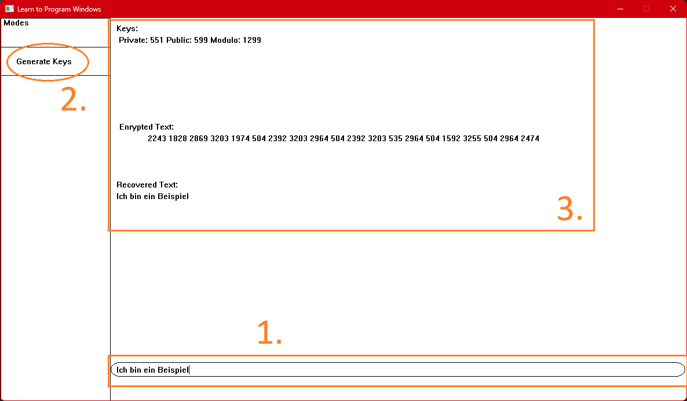

# Dokumentation MsgApplication

## Idee des Programmes
Die Idee des Programmes ist, das der Benutzter einen Text in einem interaktiven Fenster eingeben kann, welcher anschließend mit dem
RSA-Algorythmus verschlüsselt wird. RSA steht für Rivest-Shamir-Adleman, die Erfinder dieser asymmetrischen Verschlüsselungstechnik. Um diese Idee umzusetzen, verwende ich 
C++. Dies war im nachhinein nicht die beste Wahl, da das Erstellen und Ändern eines Fensters mit C++ schwieriger und zeitintensiver ist als in z.B. Java. 
Weiterhin muss man bei der RSA-Verschlüsselung eine große Zahl mit einer anderen großen Zahl potentieren, was zu riesigen Zahlen führt. Um diese Zahlen zu 
speichern, reichen die Bitlängen der Standard Variablen nicht aus. Da C++ auch keine Bibilotek hat, welche die Speicherung und Verarbeitung dieser Ergebnisse 
vereinfacht, musste ich mir ein Verfahren ausdenken, mit welchem sich diese Werte speichern und verarbeiten lassen, und dieses Verfahren in der Klasse 
[calcW.cpp](#calcWcpp) umgesetzt. 

Der RSA-Algorythmus wird nicht zum Ver- und Entschlüsseln von z.B. langen Texten benutzt, sondern dient der Übertragung von Schlüsseln wie z.B. 
symmetrischen Schlüsseln und der Autentifizierung von z.B. Webseiten zwischen zwei Geräten.

## Aufbau des Programmes MsgApplication
Zur Veranschaulichung des Programmaufbaues ist nachfolgend ein Flussdiagramm dargestellt, anhand dessen das Programm erläutert wird.

Das Programm startet aus dem Hauptprogramm MsgApplication.cpp mit der Erzeugung eines Schlüsselpaars. Dazu wird die Funktion `newThreadToCheck()` aus der Klasse `generateKey.h` aufgerufen. 
Im Anschluss wird ein Dialog-Fenster erstellt, in dem Text eingegeben werden kann. Dafür wird die Funktion create() aus der selbst geschriebenen Klasse `window.h` aufgerufen. Diese Klasse 
benutzt für die Erstellung des Fensters die `windows.h` Bibilothek. `windows.h` beinhalted fast alle Funktionen, welche das Programm zum erstellen des Dialog-Fensters benötigt. Das 
Fenster besteht aus 3 Bereichen, von welchen 2 interaktiv sind.

Der erste Bereich des Fensters ist die Elipse, wo die eingegebenen Buchstaben angezeigt werden. Der zweite Bereich ist das Rechteck am rechten Rand mit der Inschrift "Generate Keys". 
Sollte man das Rechteck anklicken, werden neue Schlüssel generiert. Der letzte Bereich ist der Ausgabebereich. Er ist am größten, da dort die momentan verwendeten Schlüssel, 
der verschlüsselte Text und der wieder entschlüsselte Text dort ausgegeben wird. Um die Eingaben des Textes und den Klick auf das Rechteck zu regestrieren, benötigt man aber noch eine 
Möglichkeit Events wie einen Mausklick wahrzunehmen. Dies macht man in C++ mit der *Message Loop*. Diese startet nach der Erstellung des des Fensters, um auf Systemnachichten zu 
reagieren. Die *Message Loop* wird mit dem folgenden Code aktiviert (window.cpp: Z.60 - 64):

~~~cpp
while (GetMessage(&msg, NULL, 0, 0) > 0)
    {
        TranslateMessage(&msg);
        DispatchMessage(&msg);
    }
~~~
Die *Message-Loop* besteht aus einer while-Loop, in welcher ein switch-Statement, je nach ID einer erhaltenen Systemnachicht, Code ausführt. Sollte diese Systemnachicht leer sein, 
also nicht größer als Null, verlässt das Programm die Loop.

Systemnachichten werden vom Betriebssystem bei z.B. Tastatureingaben oder Windows-internen Aktionen
erzeugt und bestehen aus 3 Parametern: `UINT uMsg` = ID der Nachricht: dient der Herausfilterung der Nachicht; `WPARAM wParam` und `LPARAM lParam` = enthalten extra Informationen, 
z.B. bei der Nachicht mit der ID `WM_CHAR` (wird gesendet, wenn eine Taste gedrückt wird), enthält wParam den eingegebenen Buchstaben). 
Besonders Wichtig in meinem Programm sind die IDs `WM_CHAR` und `WM_PAINT`. `WM_CHAR` wird, wie oben schon erwähnt, vom System gesendet, wenn eine Taste auf der Tastatur gedrückt wurde,
wobei bei dieser Nachicht `wParam` den Key-Code der Taste enthält. Sollte die *Message-Loop* nun also eine Nachicht mit der ID `WM_CHAR` erhalten, wird mit einem weiteren 
switch-Statement geprüft, ob ein Sonderzeichen, wie z.B. *Backspace* gedrückt wurde. Sollte dies der Fall sein, wird der Eingegebene Text nach der Funktion der Taste entsprechend 
geändert. Sollte aber *Enter* gedrückt worden sein, so wird der eingegebene Text mit der Klasse `endecryp` verschlüsselt. Sollte kein Sonderzeichen gedrückt worden sein, wird der Wert
von `wParam` einfach an den eingegebenen Text angehängt. Im Anschluss wird unabhängig von der Tastatureingabe die Funktion `InvalidateRect()` aufgerufen, welche dem Betriebssystem einen
Bereich im Fenster gibt, welcher als "invalid" markiert wird. Das heißt, dass bei dem nächsten Aufruf von `WM_PAINT` dieser Bereich neu beschrieben werden muss. Aus diesem Grund ist
`WM_PAINT` ebenfalls eine wichtige Nachicht für mein Programm. Sollte eine Nachicht mit der ID `WM_PAINT` registiert werden, signalisiert dies, dass das Fenster neu beschrieben werden
soll. Nur der Aufruf vn `WM_PAINT` veranlasst jedoch noch nicht, dass das ganze Fenster neu beschrieben werden soll, da unter Windows, die daten eines Fensters geändert werden können,
z.B. ein neuen Strich malen, diese Änderung jedoch nur sichbar wird, sollte man dem Betriebssystem mitteilen, das ein bestimmter Bereich neu beschrieben werden soll. Dies tut
InvalidateRect(). Sollte ich also InvalidateRect() nach einer Änderung von z.B. Text welche ausgegeben werden soll nicht aufrufe und selber die Nachicht `WM_PAINT` versenden, passiert die
Änderung zwar, ist jedoch nicht sichtbar, da Windows das Fenster noch nicht neu beschrieben hat. Sollte die *Message-Loop* eine Nachicht mit der ID `WM_PAINT` registrieren, 
wird der Code in dem `case WM_PAINT:` Statement ausgeführt, was dazu führt, das dort alle Funktionen, welche das Fenster verändern, wie `DrawTextW()`, aufgerufen werden.
Die Systemnachicht `WM_PAINT` wird immer am Ende von `InvalidateRect()` gesendet.

## Nächsten Schritte
Das Programm ist noch lange nicht so, wie ich es mir vorgestellt habe. Es fehlen noch viele Erweiterungen, die dieses Programm tatsächlich sinnvoll machen würden. So könnte man noch eine
Blockschiffren-Verschlüsselung implementieren und einen Server aufsetzten, um z.B. Nachichten von einem Gerät, über den Server, zu einem anderen schicken könnte. Dazu wäre die
RSA-VErschlüsselung zwar nicht gut geeignet, jedoch könnte man sie nutzten, um einen sicheren Schlüsselaustausch der Symmetrischen Schlüssel der Blockschiffre zwischen den Geräten zu 
gewährleisten. Dies ist aber mindestens nochmal so aufwendig, wie die RSA-Verschlüsselung zu implementieren. Da ich aber so viel Zeit für die Erstellung und Sylung des Fensters, sowie
die Klasse `calcW.h` benötigt habe, habe ich nicht genug Zeit für solche Änderungen gehabt.

Mir ist auch bewusst, dass das Fenster noch lange nicht "gut" aussieht, jedoch hatte ich mich mit dem Design des Fensters erst
gegen Ende beschäftigt, da die Klasse `calcW.h` zu schreiben, sehr viel anspruchsvoller war als gedacht. Ich habe mich fast die
gesammten Winterferien damit beschäftigt diese Klasse zu schreiben, da in C++ keine Bibilotek existiert, welche die Berechnung
von großen Zahlen in vereinfacht.

## Benutzte Klassen
### Auflistung aller selbstgeschriebenen und benutzten Klassen in dem Programm

- [MsgApplication.cpp](#MsgApplicationcpp)
- [generateKey.cpp](#generateKeycpp)
- [calcW.cpp](#calcWcpp)
- [endecrypt.cpp](#endecryptcpp)
- [window.cpp](#windowcpp)

## Importierte Funktionen/Libaries und DatenTypen

- windows.h -> benutzt für das Fenster und Windows eigene Datentypen (UINT, TCHAR, ...)
- thread -> benutzt für die Gleichzeitige Erstellung von dem Fenster und dem Schüssel
- iostream -> "Standart" Bibilotek, vereinfacht die Ausgabe von Text, Variablen, usw...; Viele andere Bibiloteken bauen auf ihr auf
- vector -> auch Liste genannt, dynamisches Array, was die Handhabung von Arrays einfacher macht (keine statische Größe, mehr möglichkeiten mit den Daten zu 
interagieren(.push_back(); .size(); .clear(); ...)
- chrono -> benutzt um die Ausführungszeit eines Programmabschnittes zu bekommen
- math.h -> nur für pow(x,y) benutzt
- WindowsX.h -> Benutzt um die X und Y Koordinaten aus der System-Nachicht zu bekommen, welche bei einem Mausklick abgeschickt wird (GET_X_LPARAM(lparam), 
GET_Y_LPARAM(lparam))

## Erklärung der einzelnen Klassen (chronoligisch)

### MsgApplication.cpp
Main Klasse. Das Programm startet hier und ruft die anderen Klassen auf.   

`keyget.newThreadToCheck();`

Ruft die Funktion newThreadToCheck() auf, um ein Schlüsselpaar zu erzeugen.

`window.create();`

Ruft die Funktion von window.cpp “void create()” auf. Diese sorgt für die Erstellung des Fensters.
Genauere Erklärung in [window.cpp](#windowcpp)

### generateKey.cpp
Klasse, welche ein kompatibles Schlüsselpaar erstellt

`void generateKey::newThreadToCheck()`

Diese Funktion wird der Klasse aus MsgApplication aufgerufen. Sie prüft, ob schon ein Schlüssel vorliegt. Sollte dies nicht der Fall sein, 
wird ein neues Schlüsselpaar erstellt (bisher wird der generierte Schlüssel noch nicht gespeichert).
Sollte kein Schlüssel vorliegen, wird die Funktion `generate()` aufgerufen, welche die Schlüssel generiert.
Anschließend werden die generierten Schlüssel in der Funktion `setKeys()` an die Klasse `endecrypt()` übergeben, dort gespeichert und anschließend zum ver- und entschlüsseln benutzt.

`void generateKey::generate()`

Sollte kein Schlüssel gefunden worden sein, wid die Funktion von `newThreadToCheck()` aufgerufen. Sie generiert ein Schlüsselpaar, welches im weitern Verlauf des 
Programmes zum Ver- und Entschlüsseln genutzt wird.

~~~cpp
//set p and q to randomly chosen primes from the list
	q = primes[(rand() % (primes.size() - 1))];

	p = primes[(rand() % (primes.size() - 1))];

	//calculate n and m
	n = p * q;

	m = (p - 1) * (q - 1);
~~~
Das Schlüsselpaar wird von zwei zufällig ausgewählten Primzahlen `UINT q, p` aus der Liste `vector<UINT>primes` ausgewählt, die bei jedem Programmstart neu errechnet wird. 
Die beiden Primzahlen werden anschließend miteinenannder multipliziert, sodass man die Variable `UINT n` erhält.

Um nun die Variable `UINT m` zu erhalten subtrahiert man die einzelen werte `p, q` mit 1, sodass man die Operation `m = (p - 1) * (q - 1);` bekommt.

~~~cpp
BOOL running = true;
	while (running) {
		e = primes[(rand() % (194 + 1))];
		for (int i = 0; i < partofm.size(); i++) {
			if (e != partofm[i] && e < m) {
				running = false;
				break;
			}
		}
	}
~~~
Jetzt hat man alle Werte, welche man benötigt, um die Variable `UINT e` zu brerechnen, welche in diesem Programm der öffentliche Schlüssel ist.
Die Kriterien, die man bei der Generierung von `e` beachten muss, sind, das `e` teilerfremd zu und kleiner als `m` sein muss. Dazu erstellen wir erst ein Vektor, welcher 
alle Teiler von m speichert. Diesen füllen wir, indem das Programm eine temporäre Variable `mcurr`, welche gleich `m` gesetzt wird, in einer for-Schleife durch den Wert 
von der Zähler-Variable `i` teilt. Sollte `m % i == 0` sein, wird `mcurr` nun also durch `i` geteilt und `i` wird in 
dem Vektor `partofm` gespeichert. Wichtig ist es zu beachten, dass die Zählervariable `i` mit 2 startet, da sonst der Vektor mit dem Wert 1 geflutet wird, da eine 
eine Divison durch 1 immer einen Rest von 0 hat.

Um nun `e` tatsächlich bestimmen zu können, wählen wir zufällig aus dem Vekor eine Primzahl aus, und gucken ob die Kriterien auf sie zutreffen.

~~~cpp
while (true) {
	divis.push_back(tempe / tempm);
		modulo = tempe % tempm;
		if (modulo != 0) {
			tempe = tempm;
			tempm = modulo;
			if (tempe < tempm) {
				tempm = tempe;
					tempe = modulo;
			}
		}
		if (modulo == 0) {
			break;
		}
		cdivis++;
	}

	//finaly get d
	int tempi;
	//repeat the formula b = a - (e/m * b) until the first entry in divis
	for (int i = cdivis - 1; i >= 0; i--) {
	tempi = i;
		prevb = b;
		b = a - divis[i] * b;
		a = prevb;
	}

	//because d > 0, we have to add m to it
	ind = a;

	if (ind < 0) {
		d = ind + m;
	}
	else { d = ind; }
~~~

Nun fehlt uns nur noch der Wert `UINT d`, welcher hier der private Schlüssel ist.

Um `d` auszurechnen, benötigen wir zu erst einmal die Variablen `UINT tempe = e, tempm = m`, welche den gleichen Wert haben wie die nicht Temporären Variablen 
`e` und `m`,  da wir mit den Werten von `e` und `m` weiter rechnen müssen, aber nicht die originalen Werte verändern wollen. Deshalb erstellen wir temporäre Varíablen 
der beiden Werte.

Auch bei `d` gibt es wieder Regeln die man bei der Berechnung beachten muss. So muss `d` genau wie `e` auch teilerfremd zu `m` sein. Eine Besonderheit ist jedoch das 
`d * e % m == 1` sein muss. Nun müssen wir den Eukidishen Algorithmus anwenden, um `d` zu bestimmen. Dazu teilen wir `e / m` und `e % m` die Ergebnisse werden wie folgt 
verarbeitet: `e` nimmt nun den `m` Wert an, `m` wird zu dem ergebniss von `e % m` und wir speichern uns den Quotient von `e / m` in einem Vektor für später ab. Dies 
Wiederholen wir nun, bis `e % m == 0`.

Nun Rechnen wir mit den Variablen `int a = 0, b = 1`. Diesen Variablen werden feste Startwerte zugewiesesn, `a` hat den Startwert 0 und `b` 1. Was wir nun machen ist, 
den alten `b` wert immer in `a` schreiben, und einen neuen `b` Wert durch die Formmel `b = a - (e/m * b)`. Es ist zwar nicht ersichtlich, welcher Wert `e / m`sein soll, 
aber dafür haben wir ja im vorherigen Schritt die ganzen Werte von `e / m` in einen Vektor geschrieben. Für diesen Teil der Formel setzten wir also den schon berechnenten 
`e/m` Wert ein. Dies funktioniert indem man die Liste von dem letzten Wert hoch zum ersten läuft, da man diese Formel so oft ausrechnen muss, wie der Vektor lang ist.
Der `d` Wert ist im Anschluss dann eigentlich nur noch der Wert, welcher bei `a` am Ende steht. Sollte dieser aber negativ sein, so müssen wir ihn noch mit `m` addieren 
um endlich `d` bestimmt zu haben.

Der allerletzte Schritt ist nun, `n`, `e` und `d` in den global definierten Variablen `UINT mod2, pub2, priv2` zu speichern.

### calcW.cpp
Selbst erstellte Klasse zum Berechnen von großen Zahlen mit Hilfe von Vektoren. Diese Klasse ist selbst geschrieben und hat die meiste Zeit in Anspruch genommen.

`vector<int> calcW::turninttoarray(int a)`

Schreibt einen Integer in einen Vektor, indem der Integer modulo 10 (a % 10) gerechnet wird und das Ergebnis an den Vektor angehängt, sodass die Zahl nun umgekehrt im Vektor steht.

`vector<int> calcW::lpow(vector<int> orignum, int power)`

Erweiterung des `pow()` Befehls. Es muss eine Zahl, welche in einem Vektor gespeichert wird, und die Zahl, mit welcher die Zahl potentiert wird, eingegeben werden.
Dies ermöglicht die Rechnung von z.B. 50234324232, wo das Ergebniss in einer üblichen Variablen Arten nicht gespeichert werden kann.

`int calcW::lmod(vector<int> orgnum, int divident)`

Ermöglicht die Anwendung der Operation modulo `%` auf Vektoren.

### endecrypt.cpp
Die Klasse, welche aufgerufen wird um Text zu ver - oder entschlüsseln.

`void endecryp::setKeys(UINT priv1, UINT pub1, UINT mod1)`

Funktion, welche von `generateKey::newThreadToCheck()` aufgerufen wird. Sie setzt die Global definierten Variablen `UINT priv, pub, mod` auf die Werte, welche in 
die Funktion eingegeben werden. Sie werden zum Ent- und Verschlüsseln benötigt.

`UINT endecryp::encrypt(TCHAR c)` 

~~~cpp
calcW calcW;

	auto start = high_resolution_clock::now();

	UINT cint = (UINT)c;
	vector<int> cintarr;
	cintarr = calcW.turninttoarray(cint);	//character gets fed into a vector
	cintarr = calcW.lpow(cintarr, pub);	//vector to the power of pub
	cint = calcW.lmod(cintarr, mod);	//get the modulo of the resulting number in the array
~~~

Verschlüsselt ein Zeichen, mithilfe der Funktionen aus `calcW`. Die Verschlüsselung funktioniert, indem erst das Zeichen in einenen Integer umgewandet wird, und dann
mit `pub` (public key) potenziert wird. Anschließend wird noch der Modulo von dem errechneten Array genommen, und das Ergebniss ist das verschlüsselte Zeichen.

`TCHAR endecryp::decrypt(UINT cint)`

~~~cpp
calcW calcW;
	TCHAR c;
	vector<int>cintarr;
	cintarr = calcW.turninttoarray(cint);	 //feed the encrypted character into a vectot
	cintarr = calcW.lpow(cintarr, priv);	 //vector to the power of priv
	cint = calcW.lmod(cintarr, mod);	 //get the modulo of the resulting number in the array
	c = (TCHAR)cint;
~~~

Diese Funktion ist praktisch die gleiche wie die `encrypt` Funktion, nur statt eines Zeichens wird das Ergebniss aus `encrypt()` übergeben. Anschließend wird es 
mit `priv` potenziert, was der Private Schlüssel ist. Das Ergebniss der anschließeneden Modulorechnung ist dann der Klartext, welcher an `encrypt()` übergeben wurde.

### window.cpp
Ist für die Erstellung des Dialog-Fensters zuständig und enthält ebenfalls die Message Loop (Event Schleife).

`void window::create()`

Ruft die Funktion `wWinMain(0, 0, 0, 1);`  auf. Dadurch wird das Dialog-Fenster erstellt.

`int WINAPI wWinMain(HINSTANCE hInstance, HINSTANCE hPrevInstance, PWSTR pCmdLine, int nCmdShow)`

Funktionsname und Parameter sind von der Windows.h Bibliotek vorgegeben. Erstellt das Dialog-Fenster mit den in der Funktion definierten Merkmalen. Enthält auch die 
Message Loop, welche zum Abfangen der Inputs und System-Nachichten benutzt wird (z.B. `WM_SETFOCUS`, wenn das Fenster momentan im Vordergrund steht).
Sollte System-Nachicht mit einer ID registriert werden, wird Code ausgeführt.

~~~cpp
    while (GetMessage(&msg, NULL, 0, 0) > 0)
    {
        TranslateMessage(&msg);
        DispatchMessage(&msg);
    }
~~~
DispatchMessage()  ruft die Funktion `LRESULT CALLBACK WindowProc(HWND hwnd, UINT uMsg, WPARAM wParam, LPARAM lParam)` auf, welche ein langes switch-Statement enthält, 
wodurch die System-Nachichten herausgefiltert werden und ein der Nachicht entsprechend Code ausgeführt werden kann.
Bsp:
~~~cpp
case WM_LBUTTONDOWN:

        xPos = GET_X_LPARAM(lParam);
        yPos = GET_Y_LPARAM(lParam);
        if (xPos > 0 && xPos < 200 && yPos > 50 && yPos < 100) {
            getKeys.newThreadToCheck();
            keys = 1;
            SetRect(&rc, 0, 0, 1200, 700);
            InvalidateRect(hwnd, &rc, TRUE);
            cout << "HIT";
        }
        break;
~~~
Dieser Code wird ausgeführt, wenn die System-Nachicht die ID `WM_LBUTTONDOWM` enthält. Diese Nachicht wird von Windows gesendet, wenn die Linke Maustaste gedrückt wird.
Bei dieser Nachicht wird aber auch mehr als nur die ID der Nachicht übergeben. Jede Nachicht hat zwei weitere Parameter, welche übergeben werden: `wParam` und 
`lParam`.
In diesem Beispiel enthält lParam die x- und y-Koordinaten des Mauszeigers zum Zeitpunktes des Klicks. So kann man einen Mausklick in einem Programm verarbeiten und 
eine bestimmte Aktion ausführen, sollte der Nutzer in einem bestimmten Bereich klicken.